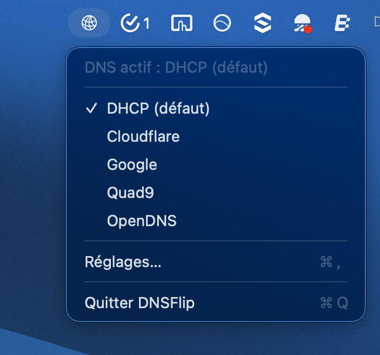
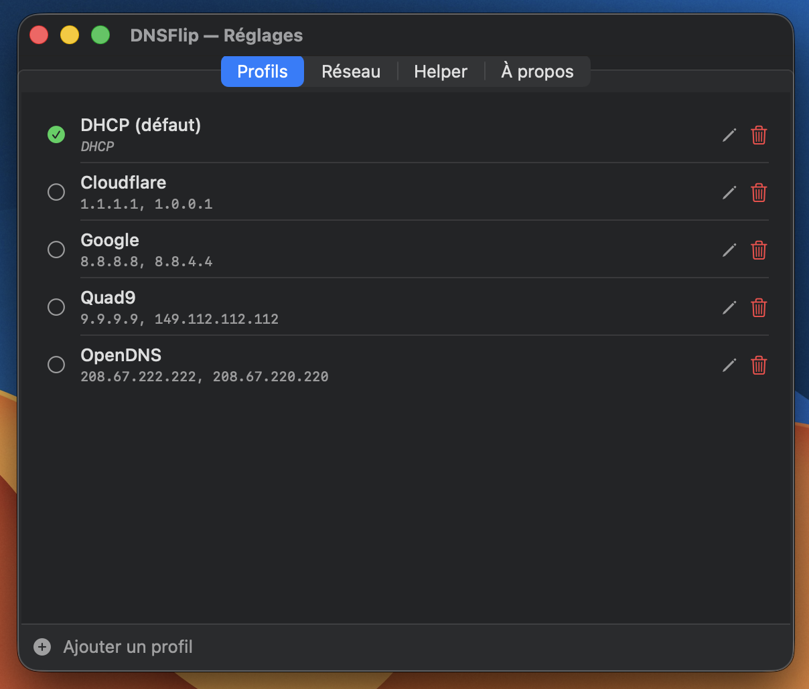
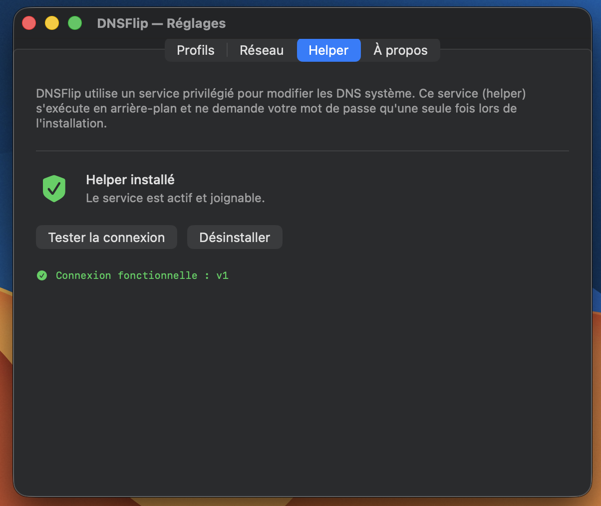

# DNSFlip

A macOS menu bar app to switch DNS server profiles instantly.

||||
|---|---|---|

## Features

- Define multiple DNS profiles (e.g. Cloudflare, Google, Pi-hole, DHCP)
- Switch the active profile in one click from the menu bar
- Changes apply system-wide via a privileged LaunchDaemon helper
- Profiles are persisted across reboots
- Automatic updates via Sparkle

## Requirements

- macOS 13.3 Ventura or later
- Apple Silicon or Intel Mac

## Installation

### Homebrew (recommended)

```bash
brew install --cask cicoub13/tap/dnsflip
```

### Manual

1. Download `DNSFlip-X.X.X.dmg` from [Releases](https://github.com/cicoub13/DNSFlip/releases)
2. Open the DMG and drag DNSFlip to your Applications folder
3. Launch DNSFlip — it appears in the menu bar
4. Open **Settings → Helper** and click **Install** to authorize the DNS helper

## First launch

On first launch, macOS will ask you to authorize the background helper in  
**System Settings → General → Login Items & Extensions**.  
This is a one-time step required to allow privileged DNS changes.

## Uninstall

1. Open DNSFlip **Settings → Helper** and click **Désinstaller**
2. Drag DNSFlip from Applications to the Trash

Or with Homebrew:

```bash
brew uninstall --cask dnsflip
```

## Building from source

```bash
git clone https://github.com/cicoub13/DNSFlip
open DNSFlip/DNSFlip.xcodeproj
```

Build with `⌘B` in Xcode. Requires Xcode 14.3+ and macOS 13.3+ SDK.

## Changelog

See [CHANGELOG.md](CHANGELOG.md).

## License

[MIT](LICENSE) © 2026 Cyril Beslay
